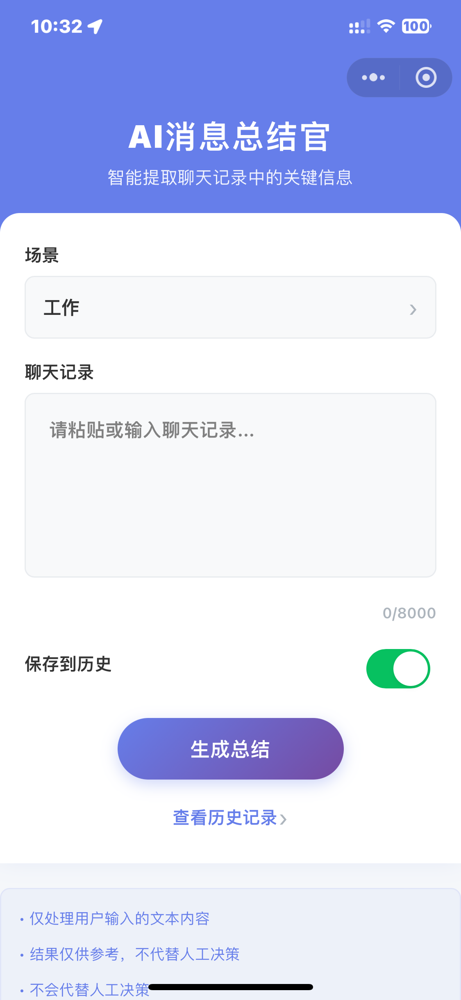
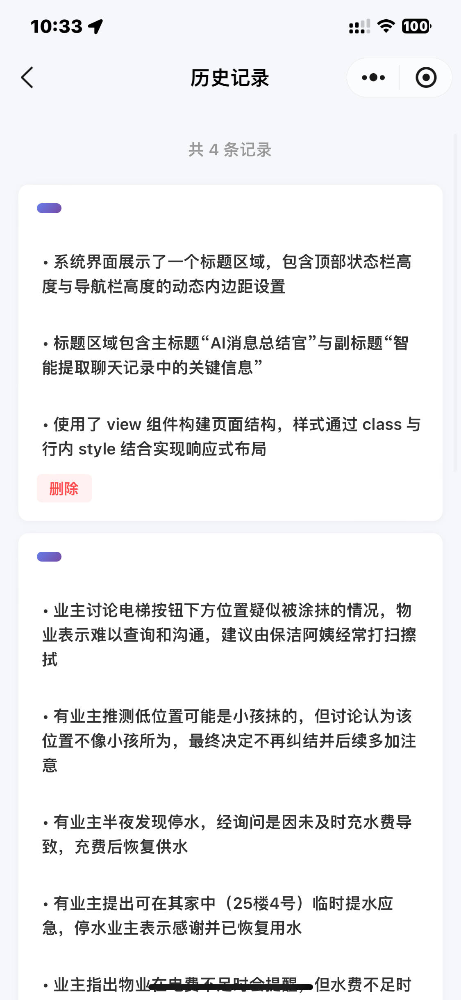
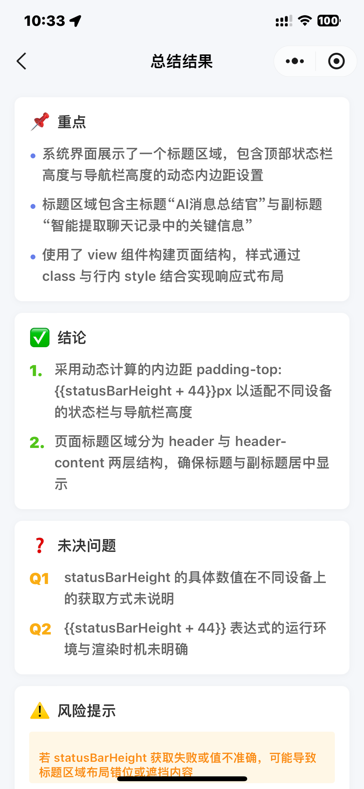
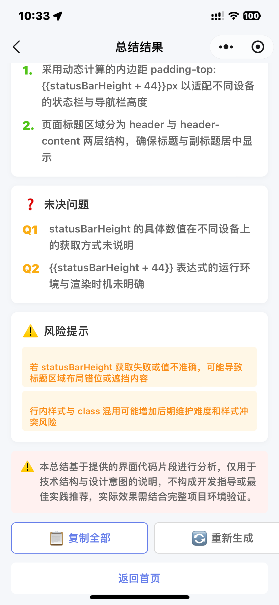

# AI 消息总结器

基于微信小程序云开发的智能消息总结工具，利用 AI Agent 自动提取聊天记录中的关键信息，包括重点、结论、待办事项、未决问题和风险提示。

## 📸 应用截图

### 首页 - 输入消息



首页提供简洁的消息输入界面，支持：
- 场景选择（工作/学习/家庭/自定义）
- 聊天记录输入（最多 8000 字符）
- 保存到历史记录开关
- 一键生成总结

### 历史记录页



历史记录页面展示所有已保存的总结：
- 显示总结要点预览
- 支持删除单条记录
- 分页加载更多记录
- 点击查看完整详情

### 总结结果页




总结结果页面以结构化方式展示：
- 📌 **重点**：关键要点列表
- ✅ **结论**：已做出的决定
- 📋 **待办**：待办事项（包含负责人和时间）
- ❓ **未决问题**：待确认的问题
- ⚠️ **风险提示**：风险因素
- 支持复制全部内容、重新生成等操作

## 📑 目录

- [功能特性](#-功能特性)
- [快速开始](#-快速开始)
- [项目结构](#-项目结构)
- [技术栈](#-技术栈)
- [项目架构](#-项目架构)
- [API 文档](#-api-文档)
- [安全性](#-安全性)
- [使用说明](#-使用说明)
- [使用示例](#-使用示例)
- [最佳实践](#-最佳实践)
- [部署与运维](#-部署与运维)
- [开发指南](#-开发指南)
- [测试](#-测试)
- [常见问题](#-常见问题)
- [相关文档](#-相关文档)
- [更新日志](#-更新日志)
- [版本信息](#-版本信息)

## ✨ 功能特性

### 核心功能

- **AI 智能总结**：基于腾讯云 AI Agent，支持多种场景的消息总结
- **流式响应**：实时显示 AI 生成过程，提升用户体验
- **历史记录**：保存和管理历史总结记录
- **多场景支持**：工作、学习、家庭、自定义场景
- **智能提取**：自动提取重点、结论、待办事项、未决问题和风险提示
- **用户隔离**：基于 openid 实现用户数据隔离，保护隐私

### UI/UX 设计

- **统一渐变设计**：顶部导航栏采用紫色渐变，视觉效果现代化
- **响应式布局**：适配不同设备的屏幕尺寸和状态栏高度
- **卡片式布局**：历史记录和总结结果采用卡片式设计，清晰易读
- **图标引导**：使用彩色图标（📌✅❓⚠️）快速识别内容类型
- **直观交互**：简洁的操作流程，易于上手

### 场景化总结

- **工作场景**：重点关注会议纪要、任务分配、决策结论、待办事项、风险提示
- **学习场景**：重点关注知识点总结、学习要点、疑问解答、后续学习计划
- **家庭场景**：重点关注重要事项、家庭决策、待办安排、情感交流
- **自定义场景**：支持自定义总结偏好

### 总结内容

- **重点列表**：3-10 个关键要点
- **结论列表**：已做出的决定或结论（0-10 个）
- **待办事项**：包含任务描述、负责人提示、时间提示
- **未决问题**：待确认的问题（0-10 个）
- **风险提示**：标记风险因素（0-10 个）
- **免责声明**：结果仅供参考

## 🚀 快速开始

### 前置要求

- 微信开发者工具
- 微信小程序账号
- 已开通云开发环境

### 安装步骤

1. **克隆项目**
   ```bash
   git clone <repository-url>
   cd ai-message-summarizer
   ```

2. **配置云开发环境**

   在 `miniprogram/app.js` 中配置云开发环境 ID：
   ```javascript
   this.globalData = {
     env: "your-env-id", // 替换为你的云开发环境 ID
   };
   ```

3. **上传云函数**

   在微信开发者工具中，依次上传以下云函数：
   - `login` - 登录云函数（新建）
   - `summarize` - 消息总结云函数
   - `historySave` - 保存历史记录云函数
   - `historyList` - 获取历史列表云函数
   - `historyGet` - 获取历史详情云函数
   - `historyDelete` - 删除历史记录云函数

   右键点击云函数目录，选择"上传并部署：云端安装依赖"

4. **创建数据库集合**

   在云开发控制台创建 `summaries` 集合，权限设置为"所有用户可读，仅创建者可写"

5. **配置 AI Agent**

   确保云开发环境中已配置 AI Agent，botId 为 `agent-message-8gp7tymn95fb752c`

## 📁 项目结构

```
ai-message-summarizer/
├── cloudfunctions/          # 云函数目录
│   ├── login/                 # 登录云函数
│   │   ├── index.js
│   │   ├── config.json
│   │   └── package.json
│   ├── summarize/             # 消息总结云函数
│   │   ├── index.js
│   │   ├── config.json
│   │   └── package.json
│   ├── historySave/           # 保存历史记录云函数
│   │   ├── index.js
│   │   ├── config.json
│   │   └── package.json
│   ├── historyList/            # 获取历史列表云函数
│   │   ├── index.js
│   │   ├── config.json
│   │   └── package.json
│   ├── historyGet/             # 获取历史详情云函数
│   │   ├── index.js
│   │   ├── config.json
│   │   └── package.json
│   └── historyDelete/          # 删除历史记录云函数
│       ├── index.js
│       ├── config.json
│       └── package.json
├── miniprogram/                # 小程序前端代码
│   ├── pages/                  # 页面目录
│   │   ├── index/              # 首页（输入消息）
│   │   ├── result/             # 结果展示页
│   │   └── history/            # 历史记录页
│   ├── components/             # 组件目录
│   ├── images/                 # 图片资源
│   │   ├── icons/              # 图标资源
│   │   ├── ai_example1.png      # AI 示例截图
│   │   └── ai_example2.png      # AI 示例截图
│   ├── app.js                  # 小程序入口
│   ├── app.json                # 小程序配置
│   └── utils/                  # 工具函数
├── project.config.json         # 微信开发者工具配置
└── README.md                   # 项目说明文档
```

## 🛠️ 技术栈

- **前端框架**：微信小程序原生框架
- **云服务**：微信云开发（CloudBase）
- **AI 能力**：腾讯云 AI Agent
- **数据库**：云开发文档型数据库
- **存储**：云开发文件存储
- **语言**：JavaScript / Node.js

## 🏗️ 项目架构

### 系统架构图

```
┌─────────────────────────────────────────────────────────┐
│                     微信小程序前端                        │
│  ┌──────────┐  ┌──────────┐  ┌──────────────────────┐  │
│  │  首页    │  │ 结果页   │  │    历史记录页        │  │
│  │  输入    │  │  展示    │  │    列表/详情        │  │
│  └──────────┘  └──────────┘  └──────────────────────┘  │
└─────────────────────────────────────────────────────────┘
                           │
                           ▼
┌─────────────────────────────────────────────────────────┐
│                    微信云开发平台                         │
│  ┌──────────────────────────────────────────────────┐  │
│  │                  云函数层                         │  │
│  │  ┌────────┐ ┌──────────┐ ┌────────────────────┐ │  │
│  │  │ login  │ │ summarize│ │  history* (4个)   │ │  │
│  │  └────────┘ └──────────┘ └────────────────────┘ │  │
│  └──────────────────────────────────────────────────┘  │
│                           │                              │
│  ┌──────────────────────────────────────────────────┐  │
│  │                  数据库层                         │  │
│  │  ┌────────────────────────────────────────────┐  │  │
│  │  │           summaries 集合                   │  │  │
│  │  │  - openid (用户标识)                       │  │  │
│  │  │  - text_hash (文本哈希)                    │  │  │
│  │  │  - scene (场景类型)                        │  │  │
│  │  │  - output_json (AI 结果)                   │  │  │
│  │  │  - created_at (创建时间)                   │  │  │
│  │  └────────────────────────────────────────────┘  │  │
│  └──────────────────────────────────────────────────┘  │
└─────────────────────────────────────────────────────────┘
                           │
                           ▼
┌─────────────────────────────────────────────────────────┐
│                  腾讯云 AI Agent                         │
│  ┌──────────────────────────────────────────────────┐  │
│  │              AI 消息总结 Agent                    │  │
│  │  - 工作场景 Prompt                               │  │
│  │  - 学习场景 Prompt                               │  │
│  │  - 家庭场景 Prompt                               │  │
│  │  - 自定义场景 Prompt                             │  │
│  └──────────────────────────────────────────────────┘  │
└─────────────────────────────────────────────────────────┘
```

### 数据流

1. **用户输入** → 小程序前端接收聊天记录和场景选择
2. **调用云函数** → 通过 `wx.cloud.callFunction` 调用 summarize 云函数
3. **AI 处理** → 云函数调用 AI Agent 进行消息分析
4. **流式响应** → AI Agent 返回流式数据，实时更新前端界面
5. **保存记录** → 将结果保存到数据库（可选）
6. **历史查询** → 用户可查询、查看、删除历史记录

### 安全机制

- **用户认证**：通过 `wxContext.OPENID` 获取用户唯一标识
- **数据隔离**：所有数据操作都基于 openid 进行过滤
- **权限控制**：用户只能访问和删除自己的记录
- **参数校验**：所有输入都经过严格的参数校验

## 📖 API 文档

### 云函数接口

#### 1. login - 登录接口

**请求参数**：无

**返回结果**：
```json
{
  "ok": true,
  "data": {
    "openid": "用户 openid",
    "appid": "小程序 appid",
    "unionid": "用户 unionid"
  }
}
```

#### 2. summarize - 消息总结

**请求参数**：
```javascript
{
  text: "聊天记录文本",
  scene: "work | study | family | custom",
  custom_hint: "自定义提示（可选）",
  save_history: true,
  language: "zh",
  ai_result: "AI 结果（可选，直接使用）"
}
```

**返回结果**：
```json
{
  "ok": true,
  "data": {
    "summary_points": ["重点1", "重点2"],
    "decisions": ["决定1"],
    "todos": [
      {
        "task": "任务描述",
        "owner_hint": "负责人提示",
        "due_hint": "时间提示"
      }
    ],
    "open_questions": ["问题1"],
    "disclaimer": "结果仅供参考",
    "risk_flags": ["风险1"]
  },
  "meta": {
    "from_cache": false,
    "text_hash": "文本哈希",
    "latency_ms": 1234
  }
}
```

#### 3. historySave - 保存历史记录

**请求参数**：
```javascript
{
  text: "聊天记录文本",
  scene: "work",
  custom_hint: "自定义提示",
  output_json: "AI 结果"
}
```

**返回结果**：
```json
{
  "ok": true,
  "data": {
    "id": "记录 ID"
  }
}
```

#### 4. historyList - 获取历史列表

**请求参数**：
```javascript
{
  page: 1,
  page_size: 20
}
```

**返回结果**：
```json
{
  "ok": true,
  "data": [
    {
      "_id": "记录 ID",
      "scene": "work",
      "input_len": 100,
      "created_at": "时间戳",
      "from_cache": false,
      "output_json": { /* AI 结果 */ }
    }
  ],
  "meta": {
    "page": 1,
    "page_size": 20,
    "total": 100,
    "has_more": true
  }
}
```

#### 5. historyGet - 获取历史详情

**请求参数**：
```javascript
{
  id: "记录 ID"
}
```

**返回结果**：
```json
{
  "ok": true,
  "data": {
    "_id": "记录 ID",
    "openid": "用户 openid",
    "text_hash": "文本哈希",
    "scene": "work",
    "custom_hint": "",
    "input_len": 100,
    "output_json": { /* AI 结果 */ },
    "created_at": "时间戳",
    "from_cache": false
  }
}
```

#### 6. historyDelete - 删除历史记录

**请求参数**：
```javascript
{
  id: "记录 ID"
}
```

**返回结果**：
```json
{
  "ok": true,
  "data": {
    "id": "记录 ID",
    "deleted": true
  }
}
```

## 🔒 安全性

- **用户隔离**：基于 openid 实现用户数据隔离
- **权限控制**：用户只能访问和删除自己的历史记录
- **数据验证**：所有输入都经过参数校验
- **错误处理**：完善的错误处理和日志记录

## 📝 使用说明

### 1. 输入消息

在首页输入或粘贴聊天记录，选择场景类型（工作/学习/家庭/自定义）。

### 2. 生成总结

点击"生成总结"按钮，AI Agent 会实时分析并提取关键信息。

### 3. 查看结果

总结结果以结构化的方式展示：
- 📌 重点：关键要点列表
- ✅ 结论：已做出的决定
- 📋 待办：待办事项（包含负责人和时间）
- ❓ 未决问题：待确认的问题
- ⚠️ 风险提示：风险因素

### 4. 历史管理

- 查看所有历史记录
- 查看某条记录的详情
- 删除不需要的记录
- 复制总结结果或待办事项

### 5. 导出功能

- 复制全部总结内容
- 复制待办事项列表
- 导出待办为纯文本格式

## 💡 使用示例

### 示例 1：工作场景 - 会议总结

**输入**：
```
张经理：大家好，今天开会讨论一下项目进度
小李：前端页面已经完成了80%，预计下周三可以全部完成
小王：后端接口开发完成了，正在和前端联调
张经理：好的，那我们定一下上线时间吧
小李：下周五可以上线吗？
小王：我觉得可以，但是需要测试两天
张经理：那就定下周五上线，测试工作由小王负责
```

**输出**：
- 📌 **重点**：前端进度80%，后端接口完成，定下周五上线
- ✅ **结论**：下周五上线，小王负责测试
- 📋 **待办**：完成前端剩余功能、完成联调、执行测试
- ❓ **未决问题**：测试过程中发现的问题如何处理
- ⚠️ **风险提示**：时间紧张、可能存在未发现的 bug

### 示例 2：学习场景 - 课程总结

**输入**：
```
老师：同学们，今天我们学习了Python的基础语法
小明：老师，作业是什么？
老师：完成第三章的练习题，下周一交
小红：老师，我有个问题，列表和元组的区别是什么？
老师：列表是可变的，元组是不可变的
```

**输出**：
- 📌 **重点**：学习了Python基础语法、列表与元组的区别
- ✅ **结论**：下周一提交第三章练习题
- 📋 **待办**：完成第三章练习题、复习列表和元组
- ❓ **未决问题**：无
- ⚠️ **风险提示**：信息不足

### 示例 3：家庭场景 - 活动安排

**输入**：
```
妈妈：周末我们去哪里玩？
爸爸：去公园野餐怎么样？
小明：我想去游乐园
妈妈：游乐园人太多了，而且门票也贵
爸爸：那我们去郊外的森林公园吧，那里空气好
```

**输出**：
- 📌 **重点**：周末计划去森林公园野餐
- ✅ **结论**：去森林公园野餐
- 📋 **待办**：准备野餐垫、准备食物、准备防晒用品
- ❓ **未决问题**：无
- ⚠️ **风险提示**：信息充足

## 🚀 部署与运维

### 部署步骤

1. **准备环境**
   - 注册微信小程序账号
   - 开通云开发环境
   - 获取环境 ID

2. **配置项目**
   - 修改 `miniprogram/app.js` 中的环境 ID
   - 确保 `project.config.json` 中的 AppID 正确

3. **部署云函数**
   - 使用微信开发者工具上传云函数
   - 选择"上传并部署：云端安装依赖"
   - 等待部署完成

4. **配置数据库**
   - 创建 `summaries` 集合
   - 设置权限为"所有用户可读，仅创建者可写"

5. **配置 AI Agent**
   - 确保云开发环境中已配置 AI Agent
   - 验证 botId 是否正确

### 监控与维护

1. **云函数监控**
   - 在云开发控制台查看云函数调用日志
   - 监控云函数的调用次数和耗时
   - 定期检查错误日志

2. **数据库维护**
   - 定期清理过期的历史记录
   - 监控数据库存储使用量
   - 优化查询性能

3. **AI 服务监控**
   - 监控 AI Agent 的响应时间
   - 关注 AI 调用的成功率和错误率
   - 及时处理 AI 服务异常

### 性能优化

1. **缓存策略**
   - 对相同文本使用缓存，避免重复调用 AI
   - 缓存有效期设置为 7 天

2. **分页加载**
   - 历史记录列表采用分页加载
   - 每页显示 20 条记录

3. **流式响应**
   - 使用流式响应提升用户体验
   - 实时显示 AI 生成过程

## 🔧 开发指南

### 添加新场景

1. 在 `miniprogram/pages/index/index.js` 的 `scenes` 数组中添加新场景
2. 在 `cloudfunctions/summarize/index.js` 的 `buildPrompt` 函数中添加对应的 Prompt 模板
3. 在 `PROMPT_SCHEMA.md` 中添加新场景的 Prompt 模板和示例

### 修改 Prompt 模板

编辑 `cloudfunctions/summarize/index.js` 中的 `buildPrompt` 函数来调整 AI 的行为。

### 调整输出格式

修改 `PROMPT_SCHEMA.md` 中的 JSON Schema 和 Prompt 模板来调整输出结构。

## 🧪 测试

### 本地测试

1. **云函数本地调试**
   - 使用微信开发者工具的本地调试功能
   - 在云函数中添加 `console.log` 进行调试
   - 查看本地调试日志

2. **前端测试**
   - 在模拟器中测试小程序
   - 在真机上测试实际效果
   - 测试不同设备的适配性

### 测试用例

参考 `TEST_CASES.md` 文件，包含以下测试场景：

1. **功能测试**
   - 工作场景消息总结
   - 学习场景消息总结
   - 家庭场景消息总结
   - 自定义场景消息总结

2. **边界测试**
   - 空输入测试
   - 超长输入测试（8000 字符）
   - 特殊字符测试

3. **性能测试**
   - AI 响应时间测试
   - 大量历史记录加载测试
   - 并发请求测试

4. **安全测试**
   - 用户权限隔离测试
   - 数据访问控制测试
   - 参数注入测试

### 故障排除

1. **云函数调用失败**
   - 检查云函数是否正确部署
   - 查看云函数日志
   - 验证环境 ID 是否正确

2. **AI 响应异常**
   - 检查 AI Agent 是否正常配置
   - 验证 botId 是否正确
   - 查看 AI 服务状态

3. **数据库操作失败**
   - 检查数据库集合是否存在
   - 验证数据库权限配置
   - 查看数据库操作日志

## 🐛 常见问题

### Q: 云函数部署失败？

A: 请确保：
1. 已正确配置云开发环境 ID
2. 云函数的依赖已正确安装
3. 数据库权限已正确配置

### Q: AI 响应很慢？

A: AI Agent 响应时间取决于：
1. 文本长度
2. AI Agent 的负载情况
3. 网络状况

### Q: 历史记录显示为空？

A: 请检查：
1. 是否正确部署了所有历史相关的云函数
2. 数据库集合 `summaries` 是否已创建
3. 用户权限是否正确配置

## 🎯 最佳实践

### 输入建议

1. **保持文本清晰**：确保聊天记录格式清晰，包含完整的对话上下文
2. **选择合适场景**：根据聊天内容选择最合适的场景类型
3. **控制文本长度**：建议输入 500-3000 字符，过长的文本可能影响总结质量
4. **提供完整上下文**：包含完整的对话历史，避免信息缺失

### 结果使用

1. **验证关键信息**：AI 总结仅供参考，重要决策请人工确认
2. **关注风险提示**：注意风险提示中的潜在问题
3. **跟进未决问题**：及时处理未决问题列表中的事项
4. **管理待办事项**：将待办事项导入到任务管理工具中

### 数据管理

1. **定期清理历史**：定期清理不需要的历史记录
2. **保护隐私**：不要输入包含敏感信息的聊天记录
3. **备份重要总结**：重要的总结建议复制保存到本地

## 📄 相关文档

- [微信云开发文档](https://developers.weixin.qq.com/miniprogram/dev/wxcloud/basis/getting-started.html)
- [云开发 AI Agent 文档](https://docs.cloudbase.net/ai/agent/http-agent-protocol)
- [微信小程序开发文档](https://developers.weixin.qq.com/miniprogram/dev/framework/)

## 📄 许可证

无。仅可用于学习与研究，未经授权不得用于商业用途。

## 🤝 贡献

欢迎提交 Issue 和 Pull Request！

## 📮 联系方式

如有问题或建议，欢迎通过 Issue 联系我们。

## 📝 更新日志

### v1.0.0 (2025-01-14)

**新增功能**
- ✨ AI 智能消息总结功能
- ✨ 支持工作、学习、家庭、自定义场景
- ✨ 流式响应显示
- ✨ 历史记录管理（增删查）
- ✨ 用户权限隔离
- ✨ 统一渐变 UI 设计
- ✨ 响应式布局适配

**技术实现**
- 🔧 集成腾讯云 AI Agent
- 🔧 实现流式响应处理
- 🔧 完善的数据库操作
- 🔧 用户认证和权限控制
- 🔧 JSON Schema 校验
- 🔧 缓存优化

**文档完善**
- 📚 更新 README.md
- 📚 添加 PROMPT_SCHEMA.md
- 📚 添加 DEPLOYMENT.md
- 📚 添加 TEST_CASES.md

## 📦 版本信息

- **当前版本**：v1.0.0
- **小程序基础库**：3.7.1+
- **云开发 SDK**：wx-server-sdk ~2.4.0
- **Node.js 版本**：16.x+

**注意**：本项目仅处理用户输入的文本内容，结果仅供参考，不代替人工决策。